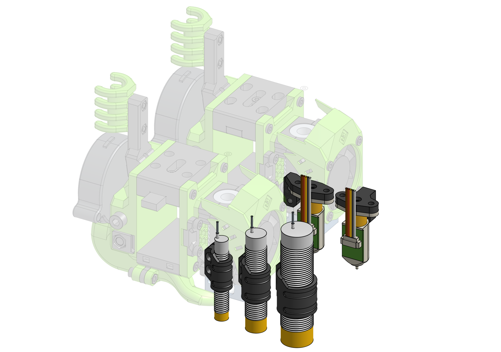

---
badges:
    - Official
---

# Bed Probing

This EVA Addon is supposed to contain different mounting solutions for different bed probe options. In some cases it might make more sense to mirror the mount in the slicer to 

{{ eva_link("probes") }}

{{ onshape_link("probes") }}

## Offsets

- 8mm Probes
    - Hemera: `X32.5`, `Y-42`
    - Aero: `X-50.55`, `Y7` or `X-13`, `Y-45.1`
    - Others: `X-28`, `Y-13`

- BLTouch
    - Hemera: `X40.48`, `Y-42.4`
    - Aero: `X-51.05`, `Y-1` or `X-5`, `Y-45.6`
    - Others: `X-28`, `Y-21`

=== "8mm Inductive Probe"

{{ bom("addons/probes/bom/inductive.csv", 4) }}

=== "BLTouch"

{{ bom("addons/probes/bom/bltouch.csv", 4) }}
